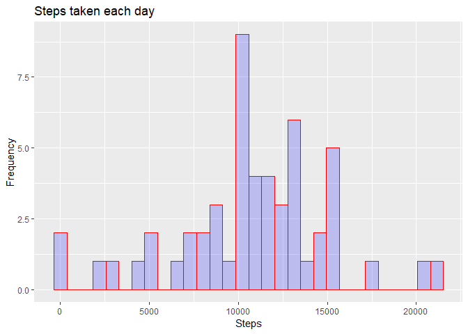
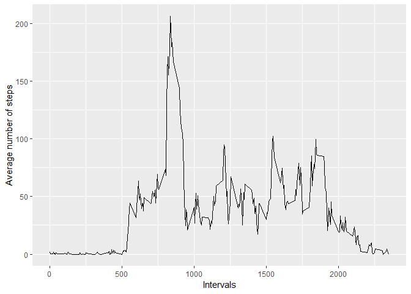
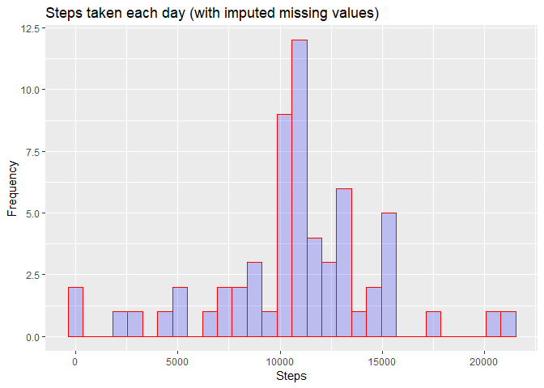
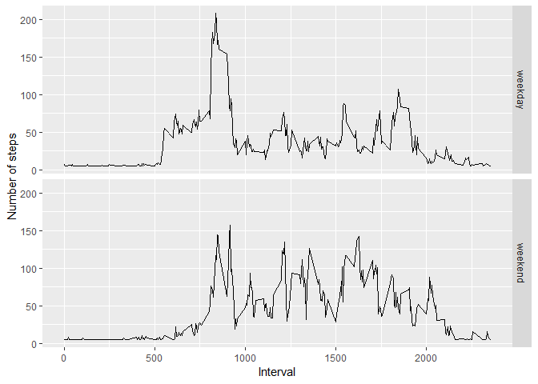

## Loading and preprocessing the data
First we are loading the necessary libraries


```r
library(readr)
library(tidyverse)
library(Hmisc)
```
Now we load the data specifying the date format

```r
activity <- read_csv("activity.zip", col_types = cols(date = col_date(format = "%Y-%m-%d")))
```
## What is mean total number of steps taken per day?

1. Make a histogram of the total number of steps taken each day


```r
steps_per_day <- activity %>% group_by(date) %>% summarise(sum(steps)) %>%  
                            rename("sum_of_steps" = "sum(steps)")

qplot(steps_per_day$sum_of_steps, 
      geom = "histogram", 
      main = "Steps taken each day", 
      xlab = "Steps", 
      ylab = "Frequency", 
      fill = I("blue"), 
      col = I("red"), 
      alpha = I(.2))
```

<!-- -->

2. Calculate and report the **mean** and **median** total number of steps taken per day


```r
mean_of_steps <- round(mean(steps_per_day$sum_of_steps, na.rm = TRUE))
mean_of_steps
```

```
## [1] 10766
```

```r
median_of_steps <- round(median(steps_per_day$sum_of_steps, na.rm = TRUE))
median_of_steps
```

```
## [1] 10765
```

## What is the average daily activity pattern?

1. Make a time series plot (i.e. type = "l") of the 5-minute interval (x-axis) and the average number of steps taken, averaged across all days (y-axis)


```r
avg_steps <- aggregate(steps ~ interval, data = activity, mean, na.rm = TRUE)

ggplot(data = avg_steps, aes(x = interval, y = steps)) +
        geom_line() +
        xlab("Intervals") +
        ylab("Average number of steps")
```

<!-- -->

2. Which 5-minute interval, on average across all the days in the dataset, contains the maximum number of steps?


```r
max_steps <- avg_steps %>% arrange(desc(steps)) %>% head(1)
max_steps
```

```
##   interval    steps
## 1      835 206.1698
```

## Imputing missing values

1. Calculate and report the total number of missing values in the dataset (i.e. the total number of rows with NAs)


```r
total_NAs <- sum(is.na(activity))
total_NAs
```

```
## [1] 2304
```

2. Devise a strategy for filling in all of the missing values in the dataset. The strategy does not need to be sophisticated. For example, you could use the mean/median for that day, or the mean for that 5-minute interval, etc.

3. Create a new dataset that is equal to the original dataset but with the missing data filled in.


```r
activity_no_NAs <- activity
activity_no_NAs$steps <- impute(activity_no_NAs$steps, fun = mean)
head(activity_no_NAs)
```

```
## # A tibble: 6 x 3
##   steps        date       interval
##   <S3: impute> <date>        <dbl>
## 1 37.3826      2012-10-01        0
## 2 37.3826      2012-10-01        5
## 3 37.3826      2012-10-01       10
## 4 37.3826      2012-10-01       15
## 5 37.3826      2012-10-01       20
## 6 37.3826      2012-10-01       25
```

4. Make a histogram of the total number of steps taken each day and Calculate and report the **mean** and **median** total number of steps taken per day. Do these values differ from the estimates from the first part of the assignment? What is the impact of imputing missing data on the estimates of the total daily number of steps?


```r
steps_no_NAs <- activity_no_NAs %>% group_by(date) %>% summarise(sum(steps)) %>% 
                                    rename("sum_of_steps" = "sum(steps)")

qplot(steps_no_NAs$sum_of_steps, 
      geom = "histogram", 
      main = "Steps taken each day (with imputed missing values)", 
      xlab = "Steps", 
      ylab = "Frequency", 
      fill = I("blue"), 
      col = I("red"), 
      alpha = I(.2))
```

<!-- -->

```r
mean_of_steps_no_NAs <- round(mean(steps_no_NAs$sum_of_steps, na.rm = TRUE))
mean_of_steps_no_NAs
```

```
## [1] 10766
```

```r
median_of_steps_no_NAs <- round(median(steps_no_NAs$sum_of_steps, na.rm = TRUE))
median_of_steps_no_NAs
```

```
## [1] 10766
```

## Are there differences in activity patterns between weekdays and weekends?

1. Create a new factor variable in the dataset with two levels -- "weekday" and "weekend" indicating whether a given date is a weekday or weekend day.


```r
activity_no_NAs$day_type <-  ifelse(as.POSIXlt(activity_no_NAs$date)$wday %in% c(0,6), 'weekend', 'weekday')
head(activity_no_NAs)
```

```
## # A tibble: 6 x 4
##   steps        date       interval day_type
##   <S3: impute> <date>        <dbl> <chr>   
## 1 37.3826      2012-10-01        0 weekday 
## 2 37.3826      2012-10-01        5 weekday 
## 3 37.3826      2012-10-01       10 weekday 
## 4 37.3826      2012-10-01       15 weekday 
## 5 37.3826      2012-10-01       20 weekday 
## 6 37.3826      2012-10-01       25 weekday
```

2. Make a panel plot containing a time series plot (i.e. type = "l") of the 5-minute interval (x-axis) and the average number of steps taken, averaged across all weekday days or weekend days (y-axis).


```r
avg_steps_no_NAs <- aggregate(steps ~ interval + day_type, data=activity_no_NAs, mean)

ggplot(avg_steps_no_NAs, aes(interval, steps)) + 
    geom_line() + 
    facet_grid(day_type ~ .) +
    xlab("Interval") + 
    ylab("Number of steps")
```

<!-- -->
